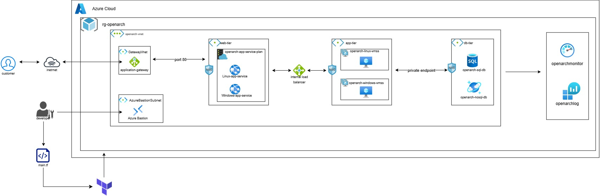

# OpenArch

> A modular Terraform-based Azure reference architecture for deploying a resilient, secure, and observable three-tier enterprise application environment.


## Overview

OpenArch is an Infrastructure as Code (IaC) project that provisions a modular three-tier application architecture on Microsoft Azure using Terraform.

The architecture separates the workload into **web, application, and database tiers**, while incorporating network segmentation, controlled access, private database connectivity, load balancing, bastion-based administration, and centralized monitoring.

The project was designed as a reusable reference architecture rather than a single-purpose application deployment. Terraform modules keep major infrastructure concerns separated, making the codebase easier to understand, maintain, and extend.

## Architecture



### High-Level Flow

``` text
                         Internet
                            │
                         Customer
                            │
                            ▼
                  ┌──────────────────┐
                  │ Application      │
                  │ Gateway          │
                  └────────┬─────────┘
                           │
                           ▼
                  ┌──────────────────┐
                  │     Web Tier     │
                  │                  │
                  │ Linux App Service│
                  │ Windows App Svc  │
                  └────────┬─────────┘
                           │
                           ▼
                  ┌──────────────────┐
                  │ Internal Load    │
                  │ Balancer         │
                  └────────┬─────────┘
                           │
                           ▼
                  ┌──────────────────┐
                  │ Application Tier │
                  │                  │
                  │ Linux VMSS       │
                  │ Windows VMSS     │
                  └────────┬─────────┘
                           │
                           ▼
                  ┌──────────────────┐
                  │    Database      │
                  │      Tier        │
                  │                  │
                  │ Azure SQL        │
                  │ Azure NoSQL      │
                  └──────────────────┘

       Developer ───────► Azure Bastion

       Application / Infrastructure
                    │
                    ▼
             Monitoring Stack
          ┌─────────────────────┐
          │ Azure Monitor       │
          │ Log Analytics       │
          │ Monitoring / Logs   │
          └─────────────────────┘
```

## Key Architecture Components

### 1. Network Layer

The network module establishes the foundational network topology and traffic controls for OpenArch.

It includes:

-   Virtual Network
-   Application Gateway subnet
-   Azure Bastion subnet
-   Web tier subnet
-   Application tier subnet
-   Database tier subnet
-   Network Security Group associations
-   Controlled traffic paths between tiers

The network is designed around the principle of limiting direct access
between application layers.

### 2. Web Tier

The web tier provides the externally accessible application hosting
layer behind the Application Gateway.

It contains:

-   Linux App Service
-   Windows App Service
-   App Service Plans
-   Network security controls

Using both Linux and Windows application environments demonstrates how the architecture can accommodate workloads with different runtime or platform requirements.

### 3. Application Tier

The application tier provides compute capacity behind an internal load balancer.

It contains:

-   Linux Virtual Machine Scale Set
-   Windows Virtual Machine Scale Set
-   Internal Load Balancer
-   Network Security Groups

The internal load balancer prevents the application compute layer from being directly exposed to the public internet.

### 4. Database Tier

The database tier provides persistent data services for the application.

It contains:

-   Azure SQL database
-   Azure NoSQL database
-   Private Endpoint connectivity
-   Network security controls

The private connectivity model is intended to keep database traffic on private Azure networking paths rather than exposing the database services directly to the public internet.

### 5. Administration

Azure Bastion provides administrative access to supported virtual machine resources without requiring public IP addresses on the virtual machines.

The intended administrative flow is:

``` text
Developer
    │
    ▼
Azure Bastion
    │
    ▼
Private VM / VMSS
```

### 6. Monitoring

The monitoring module provides centralized observability for the deployed environment.

The monitoring layer is intended to provide visibility into infrastructure performance, platform logs, and operational events across the architecture.

This separates observability from the individual infrastructure modules while allowing the monitoring layer to consume the resource outputs it needs.

## Terraform Module Structure

``` text
OPENARCH/
│
├── main.tf
├── modules.tf
├── output.tf
├── terraform.tfvars
├── variable.tf
│
└── modules/
    ├── app/
    │   ├── main.tf
    │   ├── output.tf
    │   └── variable.tf
    │
    ├── db/
    │   ├── main.tf
    │   ├── output.tf
    │   └── variable.tf
    │
    ├── monitoring/
    │   ├── main.tf
    │   └── variable.tf
    │
    ├── network/
    │   ├── associations.tf
    │   ├── main.tf
    │   ├── output.tf
    │   └── variable.tf
    │
    └── web/
        ├── main.tf
        ├── output.tf
        └── variable.tf
```

### Module Responsibilities

  -----------------------------------------------------------------------
  Module                              Responsibility
  -----------------------------------------------------------------------
  `network`                           VNet, subnets, NSGs, network
                                      associations, Application Gateway,
                                      Bastion and load-balancing network
                                      components

  `web`                               Linux and Windows App Service
                                      resources

  `app`                               Linux and Windows VM Scale Sets and
                                      application-tier compute

  `db`                                SQL and NoSQL database resources
                                      and private connectivity

  `monitoring`                        Monitoring and observability
                                      resources

  `root configuration`                Module composition, variables,
                                      Terraform configuration and outputs
  -----------------------------------------------------------------------

## Design Principles

OpenArch was designed around several coore infrastructure principles.

### Modularity

Infrastructure concerns are separated into independent Terraform modules.

This makes it possible to reason about the architecture by domain instead of maintaining one large Terraform configuration.

### Network Segmentation

The architecture separates:

``` text
Web
 │
 ▼
Application
 │
 ▼
Database
```

Each tier has its own network boundary and security controls.

### Controlled Exposure

The public entry point is the Application Gateway. Internal application and database resources are not intended to be directly exposed to the public internet.

### Private Database Connectivity

Database access is designed around private endpoint connectivity, reducing the need for public database exposure.

### Scalability

The application layer uses Virtual Machine Scale Sets, providing a foundation for horizontally scalable compute.

### Platform Flexibility

The architecture demonstrates both Linux and Windows workloads at the web and application layers.

### Infrastructure as Code

The entire environment is represented as Terraform configuration, enabling infrastructure to be provisioned consistently and repeatably.

### Observability

Monitoring is treated as a dedicated architectural concern rather than being embedded into individual application or infrastructure modules.

## Traffic Flow

### Customer Request

``` text
Customer
   │
   ▼
Internet
   │
   ▼
Application Gateway
   │
   ▼
Web Tier
   │
   ▼
Internal Load Balancer
   │
   ▼
Application Tier
   │
   ▼
Database Tier
```

### Administrative Access

``` text
Developer
   │
   ▼
Azure Bastion
   │
   ▼
Application VM / VMSS
```

### Database Access

``` text
Application Tier
       │
       ▼
Private Endpoint
       │
       ▼
Database Tier
```

## Prerequisites

Before deploying OpenArch, ensure you have:

-   An active Azure subscription
-   Terraform installed
-   Azure CLI installed
-   An authenticated Azure CLI session
-   Appropriate Azure permissions to create the required resources

Authenticate with Azure:

``` bash
az login
```

Confirm the active subscription:

``` bash
az account show
```

If you have multiple subscriptions, select the required subscription:

``` bash
az account set --subscription "<SUBSCRIPTION_ID>"
```

## Deployment

Clone the repository and move into the project directory:

``` bash
git clone <REPOSITORY_URL>
cd OPENARCH
```

Initialize Terraform:

``` bash
terraform init
```

Validate the configuration:

``` bash
terraform validate
```

Format the configuration:

``` bash
terraform fmt -recursive
```

Review the planned infrastructure:

``` bash
terraform plan
```

Apply the configuration:

``` bash
terraform apply
```

Terraform will request confirmation before creating the infrastructure
unless automatic approval is supplied.

## Destroying the Environment

To remove the infrastructure created by Terraform:

``` bash
terraform destroy
```

> **Warning:** `terraform destroy` removes resources managed by the
> Terraform configuration. Review the plan carefully before confirming.

## Outputs

After deployment, Terraform outputs can be viewed with:

``` bash
terraform output
```

The exact outputs depend on the resources exposed by the root configuration.

## Security Considerations

OpenArch incorporates several security-oriented design choices:

-   Network Security Groups are used to control traffic.
-   Azure Bastion is used for administrative access to private virtual machines.
-   The application tier is placed behind an internal load balancer.
-   Database connectivity uses private endpoint architecture.
-   The database tier is separated from the public-facing web tier.
-   Public exposure is concentrated at the Application Gateway entry point.
-   Monitoring provides visibility into infrastructure and platform activity.

These controls form part of the reference architecture and should be further hardened according to the requirements of a production workload, including identity, secrets management, encryption, backup, disaster recovery, policy enforcement, and workload-specific security requirements.

## Project Limitations

OpenArch is a reference architecture and portfolio project. It is not intended to represent a complete production landing zone or a fully hardened enterprise platform.

Potential production extensions include:

-   Azure Policy and policy-as-code
-   Microsoft Entra ID integration and workload identities
-   Azure Key Vault integration
-   Secrets management
-   Web Application Firewall configuration and tuning
-   More comprehensive backup and disaster recovery
-   Automated CI/CD deployment
-   Remote Terraform state with state locking
-   Private DNS architecture
-   Cost management and budgets
-   Security posture management
-   More extensive monitoring dashboards and alert rules

These are deliberately separated from the core architecture so that OpenArch remains modular and understandable.

## Why OpenArch?

OpenArch was built to demonstrate practical understanding of cloud infrastructure beyond individual Azure services.

The project brings together:

-   Microsoft Azure
-   Terraform
-   Infrastructure as Code
-   Network architecture
-   Three-tier architecture
-   Application Gateway
-   App Services
-   Virtual Machine Scale Sets
-   Internal Load Balancing
-   Azure SQL
-   NoSQL data services
-   Private Endpoints
-   Azure Bastion
-   Network Security Groups
-   Monitoring and observability
-   Modular infrastructure design

The focus is on how these components interact as an infrastructure
system rather than simply deploying isolated cloud resources.

## Skills Demonstrated

**Cloud:** Microsoft Azure\
**Infrastructure as Code:** Terraform\
**Networking:** VNet, Subnets, NSGs, Application Gateway, Load Balancer,
Private Endpoint\
**Compute:** App Services, Virtual Machine Scale Sets\
**Databases:** Azure SQL, NoSQL\
**Security:** Azure Bastion, network segmentation, private connectivity\
**Observability:** Azure monitoring and centralized logging\
**Architecture:** Three-tier enterprise architecture\
**DevOps:** Declarative infrastructure, modular Terraform design

## Project Status

The repository can be extended with additional production-oriented capabilities without changing the fundamental modular architecture.

## Author

**Joshua Olagunju**

Computer Science graduate focused on:

-   Cloud Engineering
-   DevOps
-   Infrastructure as Code
-   Microsoft Azure
-   Automation
-   Cloud Architecture

------------------------------------------------------------------------


